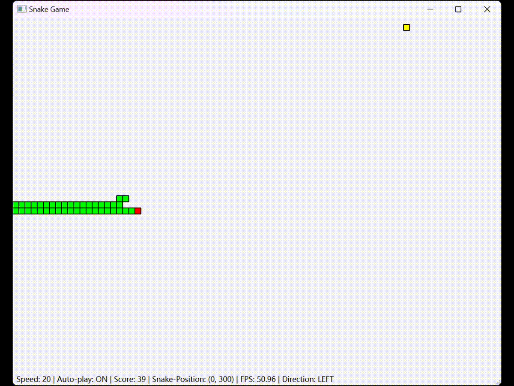

# Snake Game

## Running Environment

- Python 3.11
- PyQt6
- [Nuitka]

## Gaming Guide

### Game Modes

There are two modes in the game: `Manual Mode` & `Auto Mode`

1. **Manual Mode**

    Use the `￩ ￪ ￫ ￬` arrow keys to control the direction of the snake's movement.

2. **Auto Mode**

    Follows the nearest path principle to automatically find the best direction.

    > Known Bugs: When the snake is too long, it might get trapped by itself.

### Basic Rules

1. The game ends when the snake's head touches the border or its own body.
2. Press `R` to reset the game.
3. Press `A` to speed up the game.
4. Press `S` to slow down the game.
5. Press `Space` to switch game modes.
6. Press `C` to cancel the body conflict detect.

## Design Patterns

- Class `Snake` represents a game instance: Responsible for maintaining variables related to the snake's body and operations.
- Class `SnakeGameWindow` represents the game window: Responsible for maintaining updates to the game screen, resetting, and accepting key events.

---

# 贪吃蛇

## 运行环境

- Python 3.11
- PyQt6
- [Nuitka]

## 游玩指南

### 游戏模式

游戏有两种模式：`手动模式` & `自动模式`

1. **手动模式**

    使用 `￩ ￪ ￫ ￬` 方向按键控制🐍的移动方向。

2. **自动模式**

    采用最近路径原则自动寻找最佳方向。

    > 已知Bugs：当🐍身过长时，可能会被自身困住。

### 基本规则

1. 🐍头触碰到边界 & 🐍身体时游戏结束。
2. 按键 `R` 重置游戏。
3. 按键 `A` 加速游戏。
4. 按键 `S` 减速游戏。
5. 按键 `空格` 切换游戏模式。
6. 按键 `C` 取消身体碰撞检测。

## 设计模式

- 类 `Snake` 代表一个游戏实例：负责维护有关🐍身体，及操作的相关成员变量。
- 类 `SnakeGameWindow` 代表游戏窗口：负责维护游戏画面的更新，重置，接受按键事件等。
